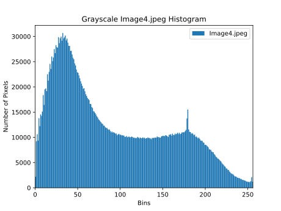

# Reddit Data Scraping
Downloaded posts from multiple subreddits using Reddit API and cleaned the data by removing stop words, stemming and lemmatization using Python’s NLTK library.

***Subreddits chosen are:***
Rochester, DMV, bookclub, plotholes, NarutoFanfiction, Ghoststories, InformationTechnology

***List of words with Highest document frequency:***
{
  'wa': 1653,
  'thi': 941,
  'hi': 866,
  'one': 535,
  'go': 519,
  'get': 515,
  'like': 486,
  'would': 437,
  'ha': 422,
  'time': 403,
  'see': 388,
  'know': 371,
  'back': 369,
  'look': 352,
  'http': 347,
  'room': 346,
  'say': 322,
  'tell': 306,
  'chapter': 305,
  'read': 301
}

***Histogram of the images:***

Histogram of the color image 1:

Histogram of the gray image 1:

Histogram of the color image 2:

Histogram of the gray image 2:

Histogram of the color image 3:

Histogram of the gray image 3:

Histogram of the color image 4:

Histogram of the gray image 4:

Histogram of the color image 5:

Histogram of the gray image 5:

***Kindly change the Auth keys and add user name and password for running the code.***
